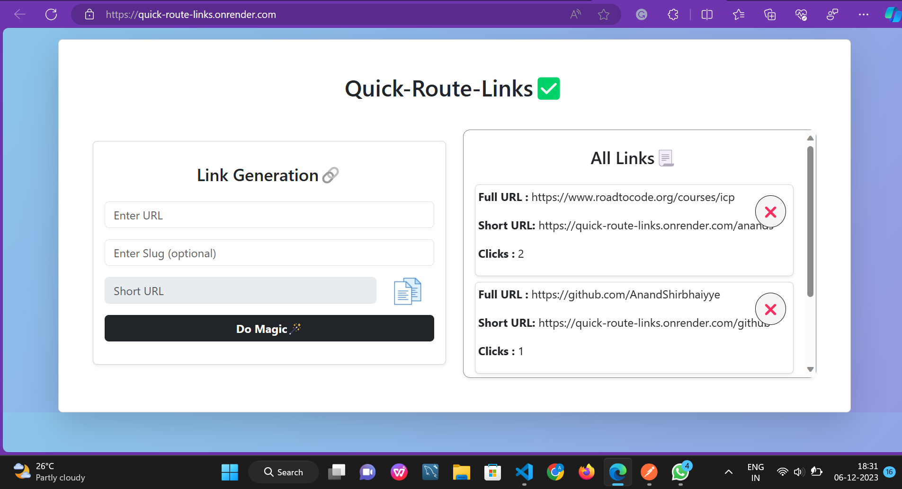

## QUICK-ROUTE-LINKS🔗🤘

#### Create a web-based service that shortens long URLs into concise, easy-to-share short links. Users can input lengthy URLs, and the system will generate a unique short URL that redirects to the original destination. Features include link analytics, custom short URLs.

 

🎯[Click here to see live website](https://quick-route-links.onrender.com/)